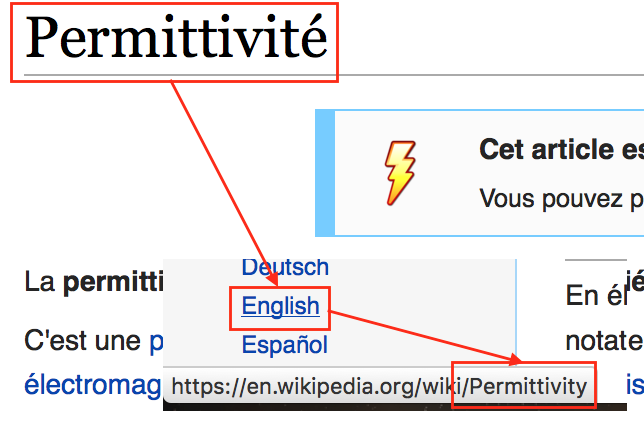

# WikiTranslate

[](https://circleci.com/gh/wikitranslate/wt-api/tree/master)

Ask experts from around the globe to find the exact translation for technical terms.
Not only is Wikipedia a great source of knowledge, it's also a great translation tool !



This package is an api to answer translation requests.

## Usage

The API is available here: https://translate.gnab.fr/

Usage is fairly simple:

```
GET /:fromLang/:toLang/:search
```

returns the associated translation.

> Example:
> ```
> GET /fr/en/Permittivité
> ```
> Will return
> ```
> HTTP/1.1 200 OK
> [...]
>
> {
>     "wikipedia": [
>         "Permittivity"
>     ],
>     "wiktionary": [
>         "permittivity"
>     ]
> }
> ```
